# Flexible Wing Aeroelastic Analysis

**Master of Science Thesis Project**

A comprehensive aeroelastic analysis of a composite flexible wing combining Finite Element Analysis (FEA) and Computational Fluid Dynamics (CFD).

---

## Project Overview

This project investigates the aeroelastic behavior of a composite flexible wing developed as part of my Master's thesis in Aerospace Engineering.

The workflow integrates structural modelling, modal analysis, transient structural simulations and aerodynamic CFD analyses to evaluate the interaction between aerodynamic loads and structural deformation.

The project was developed using ANSYS Mechanical and ANSYS Fluent.

---

## Objectives

- Design a realistic composite wing structure
- Develop an FEM model for structural analysis
- Investigate natural vibration characteristics
- Perform transient structural analysis under gust loading
- Generate CFD simulations for aerodynamic loading
- Evaluate pressure distribution and aerodynamic forces
- Assess the aeroelastic response of the wing

---

# Geometry

## Airfoil

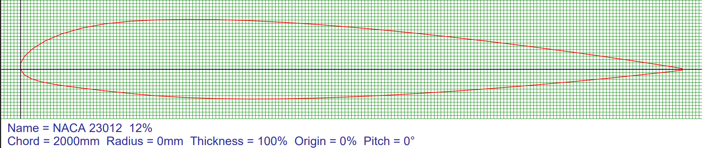

The wing is based on the NACA 23012 airfoil.

---

## Structural Design

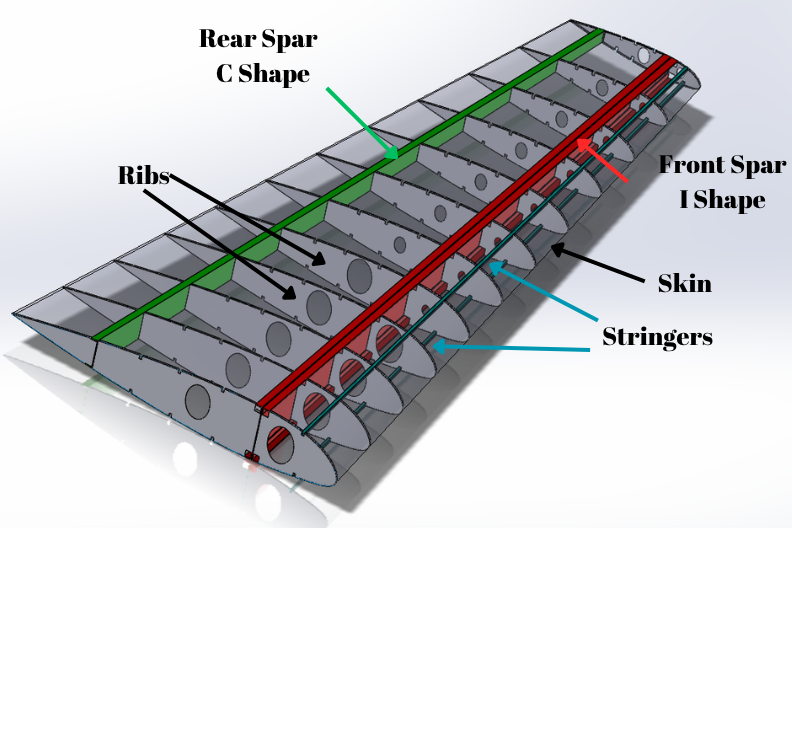

The internal structure consists of:

- Front I-shaped spar
- Rear C-shaped spar
- Composite skin
- Longitudinal stringers
- Reinforcing ribs

---

# FEM Pre-processing

## Material Assignment

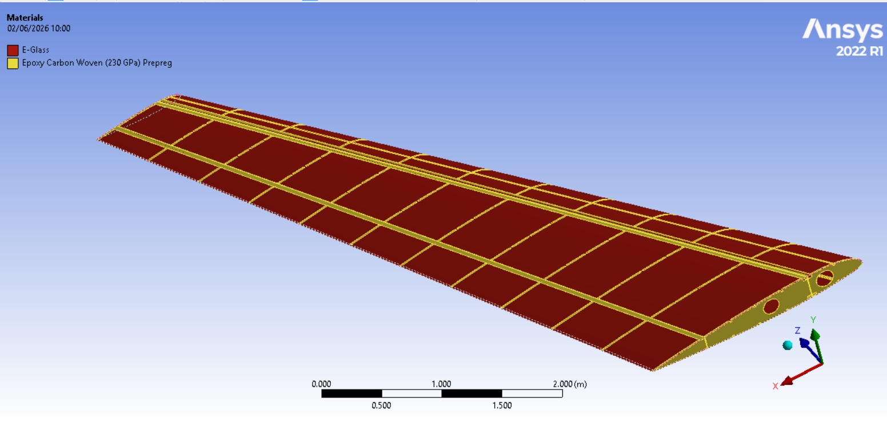

Composite materials were assigned to the wing components according to the structural design.

---

## Contact Definitions

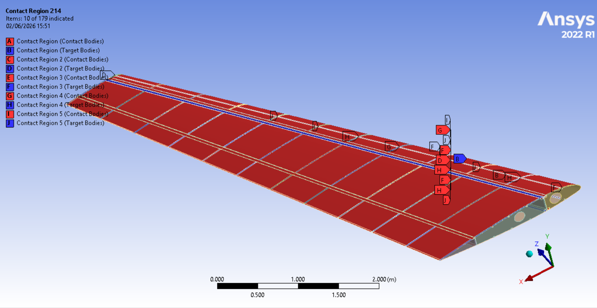

Bonded contacts were defined between structural components.

---

## Finite Element Mesh

Global mesh

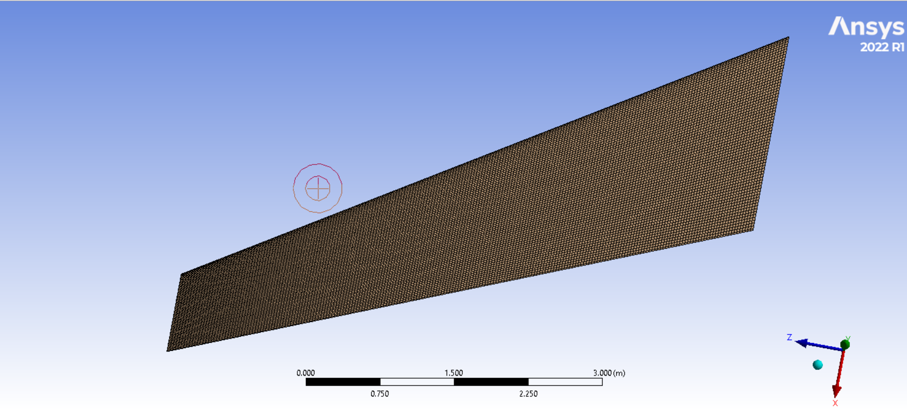

Root section

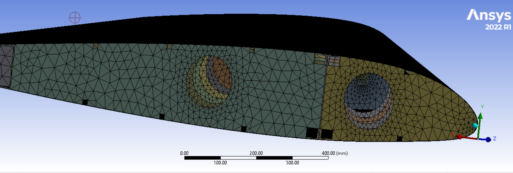

---

# Modal Analysis

The first natural vibration mode of the flexible wing.

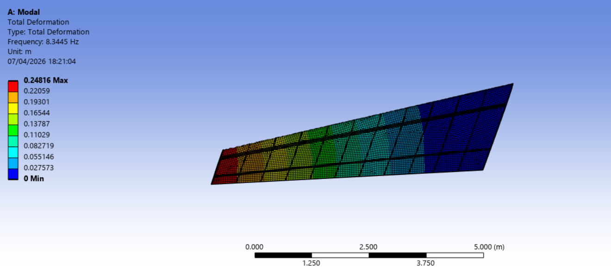

---


# CFD Pre-processing

## Computational Domain

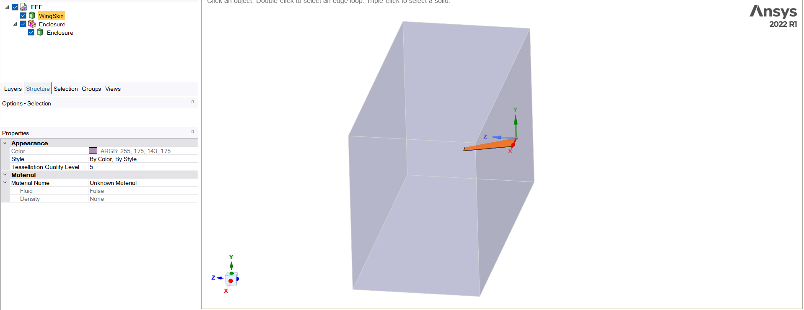

---

## CFD Mesh

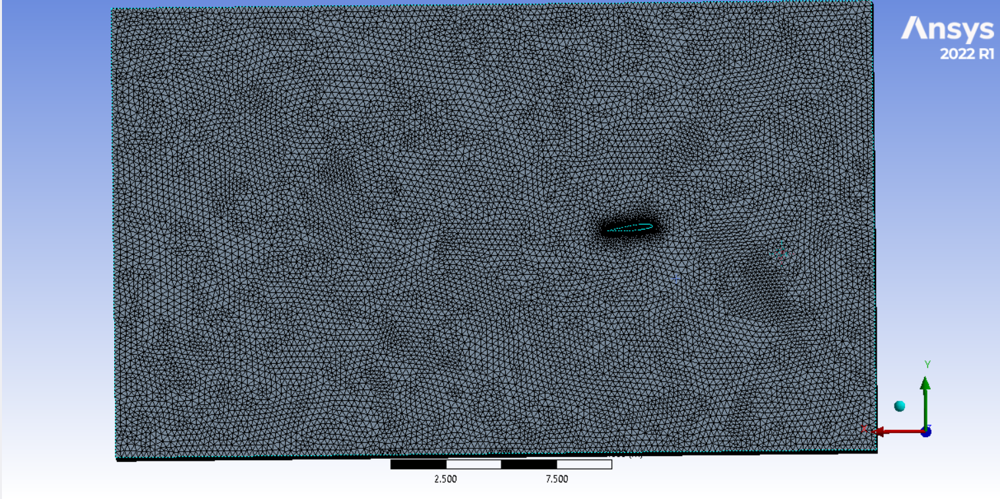

Wing surface mesh

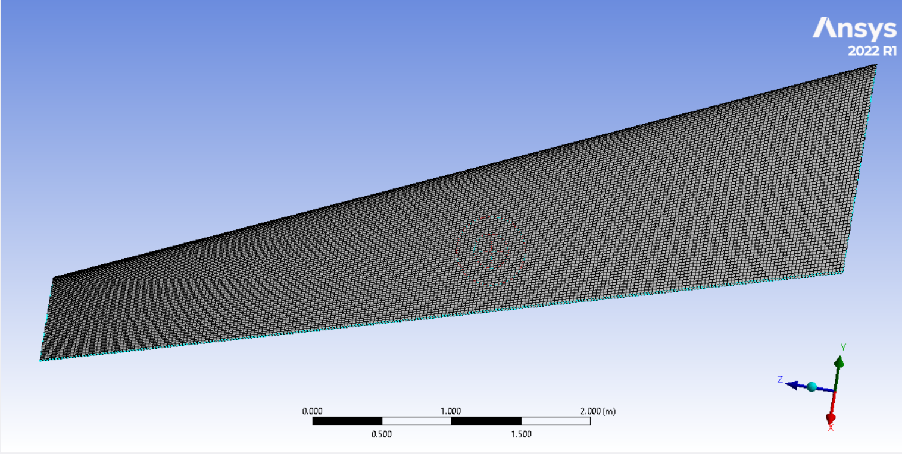

---

# CFD Results

## Pressure Distribution

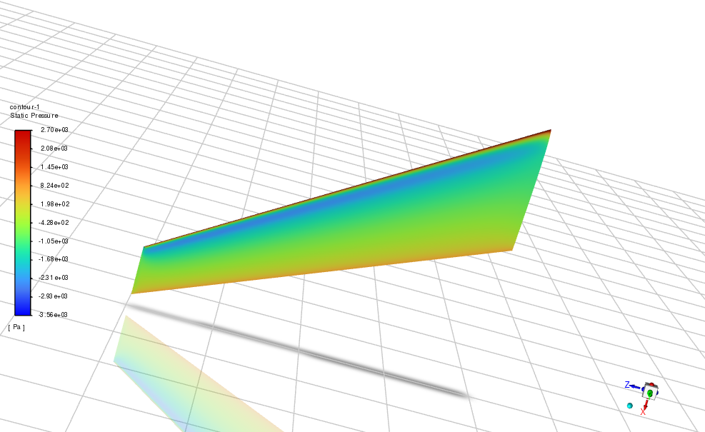

---

## Pressure Coefficient

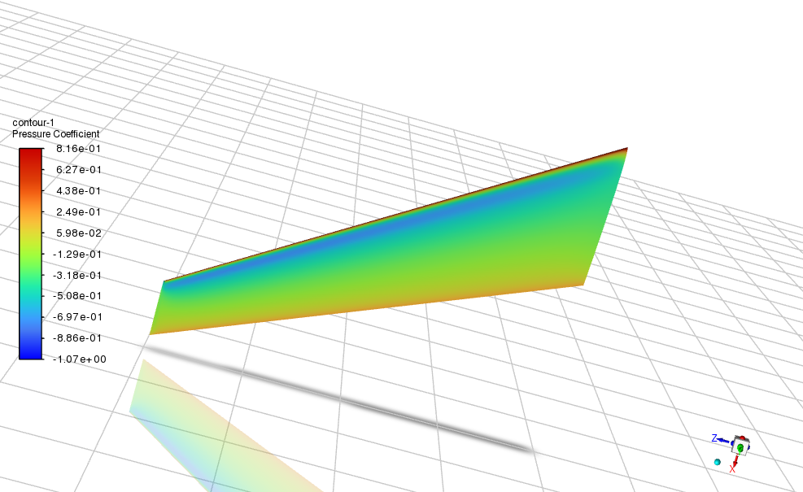

---

## Velocity Distribution

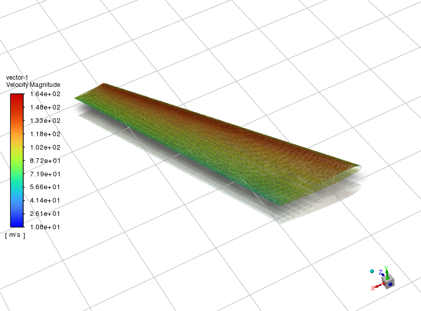

---

## Lift

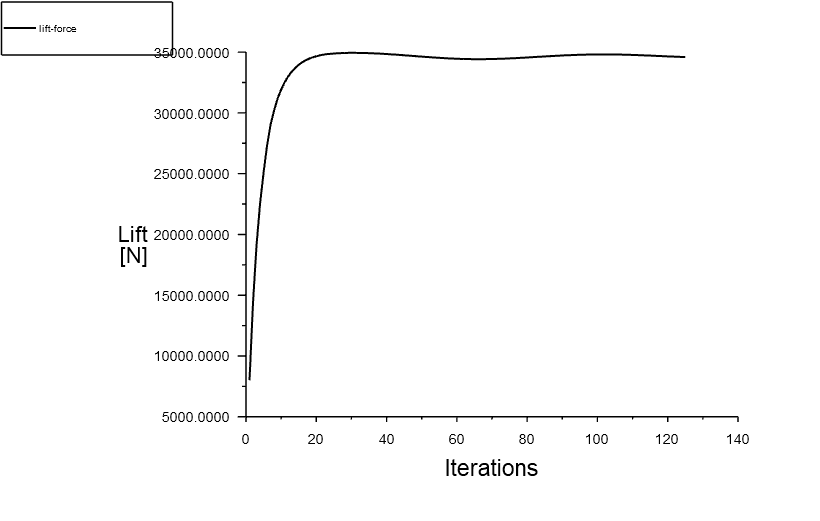

---

## Drag

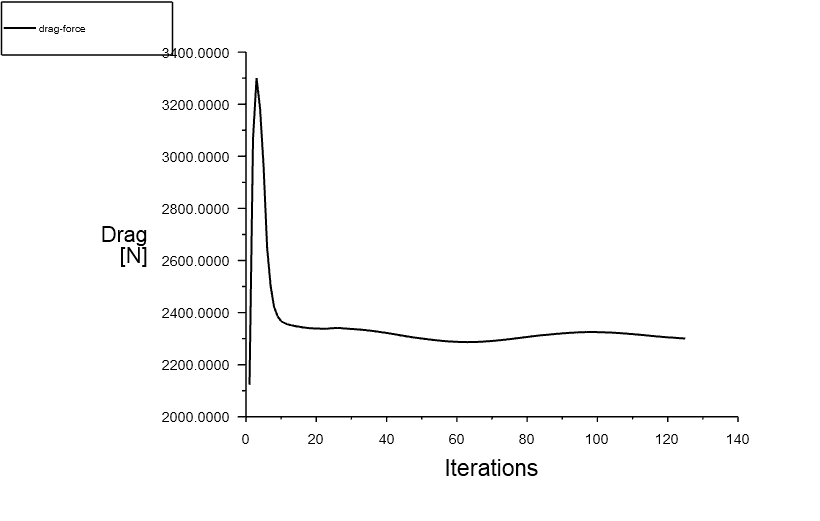

---

## Lift Coefficient

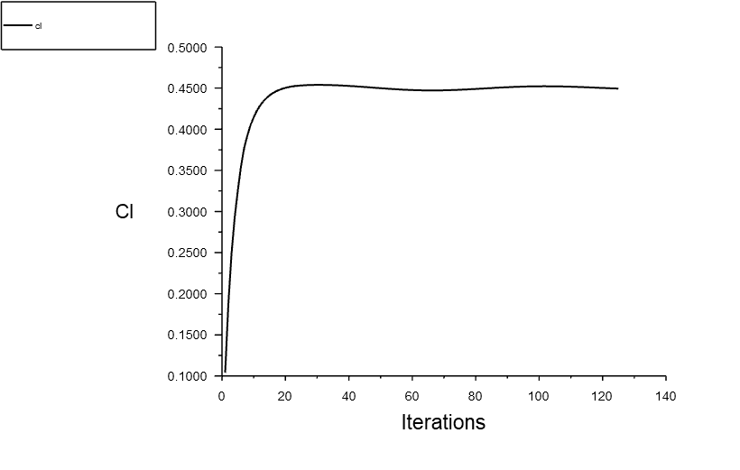

---

## Drag Coefficient

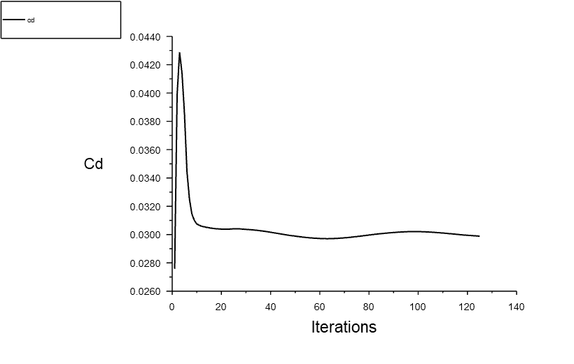

---

## Solver Convergence

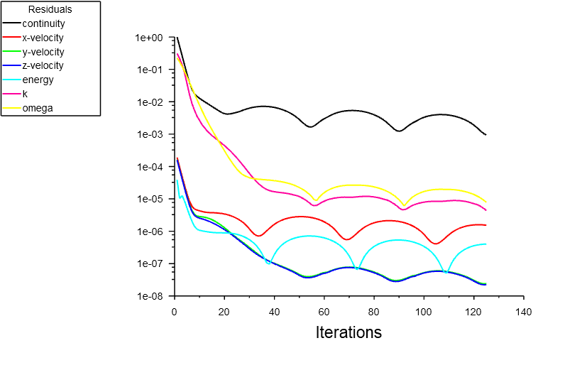

---

# Validation

The transient structural loading was generated using a validated 1-cos gust profile.

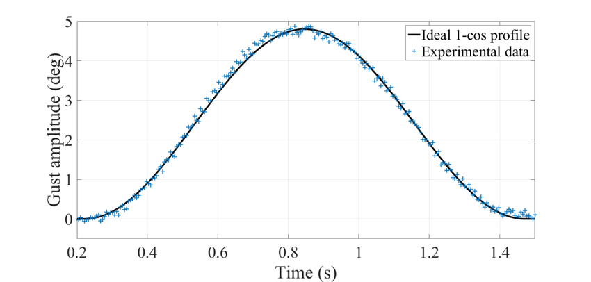

---

# Software

- ANSYS Mechanical
- ANSYS Fluent
- SpaceClaim
- Composite Pre/Post Processing

---

# Engineering Topics

- Aeroelasticity
- Structural Dynamics
- Finite Element Analysis
- CFD
- Aerodynamics
- Composite Structures
- Modal Analysis
- Transient Structural Analysis

---

# Repository Contents

```
cad/
    Structural wing geometry
    CFD wing geometry

figures/
    Airfoil
    Structural model
    FEM preprocessing
    Modal analysis
    Transient analysis
    CFD preprocessing
    CFD results
    Validation
```

---

# Note

This repository presents selected engineering results from my Master's thesis.

To protect the originality of the research, the complete thesis document and ANSYS project files are not publicly available. The repository focuses on demonstrating the engineering workflow, modelling approach, and technical competencies developed throughout the project.
